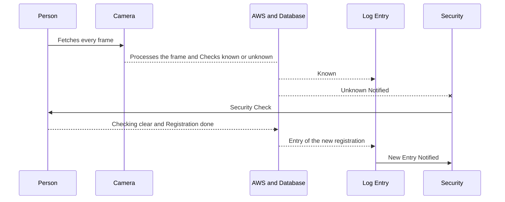
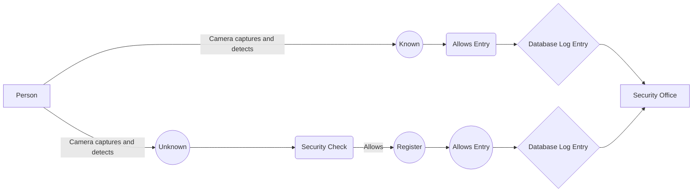
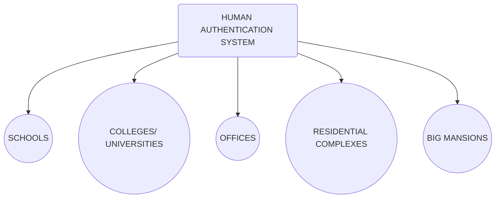

# Video Based Dynamic Human Authentication System For Access Control

## Working of our Solution

Though there exists a technology for face recognition based authentication, dynamic human recognition based authentication is highly challenging. For a given entrance gate a hardware-software solution is needed to identify every unique person who enters or exit the gate, with log of all previous entry/exit time, photo/videos recorded. 
- At the time of entry the faces of people are captured via the security cameras.
-  The images of the people entering are checked whether they are registered to enter the premises or not.
     -  if they are registered they can easily enter the premises. 
     - Otherwise the individual is not allowed to enter the premises. That means there is no previous history of an individual. 
        - The system should immediately alert the security if it is a new person and the security will decide to allow/restrict that person entering inside the premises. 
            -  The person is allowed to enter the premises only if he/she  is registered as a guest or as a daily comer. 

Our system  learns from its previous history of videos/images dynamically to allow a known person. For a given size of the gate, the number of cameras with optimal resolution required is also to be worked out as part of solution.

## UML Diagram

 
## Solution Flowchart

## Use Cases 

